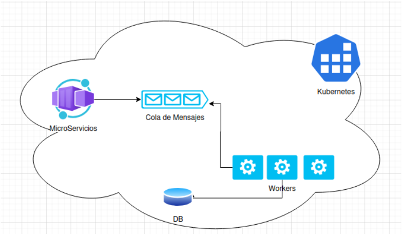
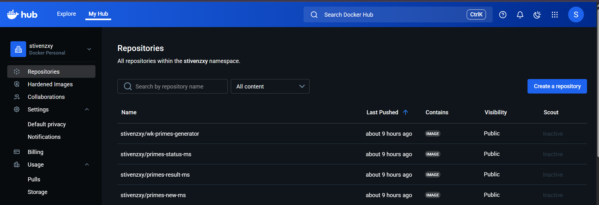

# 🔢 Distributed Prime Generator System

Sistema distribuido para generar números primos grandes usando microservicios, workers, Redis y PostgreSQL, desplegado sobre Kubernetes.

---

## 📋 Componentes del Proyecto

| Componente | Descripción |
|------------|-------------|
| **Microservicio New** | Recibe cantidad y dígitos, crea una solicitud |
| **Microservicio Status** | Informa el progreso de una solicitud |
| **Microservicio Result** | Entrega la lista de números primos generados |
| **Workers** | Consumen solicitudes desde la cola y generan números primos sin repetir |
| **PostgreSQL** | Base de datos para almacenar solicitudes y resultados |
| **Redis** | Cola de mensajes para distribuir el trabajo |

---

## 🏗️ Arquitectura



---

## 🐳 FASE 1: Construcción de Imágenes Docker

### 1. Construir imágenes localmente

```bash
docker build -t stivenzxy/primes-new-ms:1.0 ./microservices/new
docker build -t stivenzxy/primes-status-ms:1.0 ./microservices/status
docker build -t stivenzxy/primes-result-ms:1.0 ./microservices/result
docker build -t stivenzxy/wk-primes-generator:1.0 ./workers
```

### 2. Iniciar sesión en Docker Hub

```bash
docker login
```

### 3. Subir imágenes al repositorio

```bash
docker push stivenzxy/primes-new-ms:1.0
docker push stivenzxy/primes-status-ms:1.0
docker push stivenzxy/primes-result-ms:1.0
docker push stivenzxy/wk-primes-generator:1.0
```

**Imágenes subidas en Docker Hub de manera pública:**



---

## ☸️ FASE 2: Desplegar con Kubernetes

### 1. Verificar el cluster

```bash
kubectl get nodes
```

### 2. Crear namespace

```bash
kubectl create namespace primes
```

### 3. Verificar la creación del namespace

```bash
kubectl get namespaces
```

### 4. Desplegar infraestructura (Redis y PostgreSQL)

```bash
# Aplicar Redis
kubectl apply -n primes -f manifests/redis.yaml

# Inicializar base de datos con ConfigMap
kubectl apply -n primes -f manifests/postgres-init-configmap.yaml
kubectl apply -n primes -f manifests/postgres.yaml
```

### 5. Verificar que la infraestructura esté corriendo

```bash
kubectl get pods -n primes
```

### 6. Desplegar microservicios y workers

```bash
kubectl apply -n primes -f manifests/microservices-new.yaml
kubectl apply -n primes -f manifests/microservices-status.yaml
kubectl apply -n primes -f manifests/microservices-result.yaml
kubectl apply -n primes -f manifests/workers.yaml
```

### 7. Verificar el estado de todos los pods

```bash
kubectl get pods -n primes
```

> ⚠️ **IMPORTANTE:** Para realizar pruebas, **todos los pods deben tener el status `READY 1/1`** y estar en estado `Running`.

**Salida esperada:**
```
NAME                              READY   STATUS    RESTARTS   AGE
postgres-xxxxx-xxxxx              1/1     Running   0          2m
redis-xxxxx-xxxxx                 1/1     Running   0          2m
primes-new-xxxxx-xxxxx            1/1     Running   0          1m
primes-status-xxxxx-xxxxx         1/1     Running   0          1m
primes-result-xxxxx-xxxxx         1/1     Running   0          1m
primes-workers-xxxxx-xxxxx        1/1     Running   0          1m
primes-workers-xxxxx-yyyyy        1/1     Running   0          1m
primes-workers-xxxxx-zzzzz        1/1     Running   0          1m
```

### 8. Verificar servicios expuestos

```bash
kubectl get svc -n primes
```

### 9. Ver logs de los pods (para debugging)

```bash
# Logs de los workers
kubectl logs -n primes -l app=primes-worker --tail=50

# Logs de un microservicio específico
kubectl logs -n primes -l app=primes-new --tail=20
```

---

## 📖 Documentación de la API (FastAPI)

| Microservicio | URL Swagger |
|---------------|-------------|
| primes-new | http://localhost:30000/docs |
| primes-status | http://localhost:30001/docs |
| primes-result | http://localhost:30002/docs |

---

## 🧪 FASE 3: Pruebas

### Endpoints disponibles

| Método | Endpoint | Descripción |
|--------|----------|-------------|
| `POST` | `/new` | Crear nueva solicitud de primos |
| `GET` | `/status/{id}` | Consultar progreso de la solicitud |
| `GET` | `/result/{id}` | Obtener los números primos generados |

### 1. Crear nueva solicitud (POST)

```bash
curl -w "\n" -X POST http://localhost:30000/new \
  -H "Content-Type: application/json" \
  -d '{"cantidad":5,"digitos":12}'
```

**Ejemplo de salida:**
```json
{"id":"e147f6ec-50bd-4eb8-8bb1-77d5d6c1662d"}
```

### 2. Consultar estado de la solicitud (GET)

```bash
curl -s http://localhost:30001/status/<ID> | jq
```

**Ejemplo de salida:**
```json
{
  "total": 5,
  "actual": 5
}
```

> - `total`: número total de primos solicitados
> - `actual`: número de primos generados hasta el momento

### 3. Obtener resultados (GET)

```bash
curl -s http://localhost:30002/result/<ID> | jq
```

**Ejemplo de salida:**
```json
[
  611256897851,
  408660489031,
  597625133513,
  945069847651,
  439758590801
]
```

---

## 💡 Ejemplos Completos de Uso

### Ejemplo 1: Solicitar 5 primos de 12 dígitos

```bash
# 1. Crear solicitud
curl -w "\n" -X POST http://localhost:30000/new \
  -H "Content-Type: application/json" \
  -d '{"cantidad":5,"digitos":12}'
```
**Salida:**
```json
{"id":"e147f6ec-50bd-4eb8-8bb1-77d5d6c1662d"}
```

```bash
# 2. Verificar estado
curl -s http://localhost:30001/status/e147f6ec-50bd-4eb8-8bb1-77d5d6c1662d | jq
```
**Salida:**
```json
{
  "total": 5,
  "actual": 5
}
```

```bash
# 3. Obtener resultados
curl -s http://localhost:30002/result/e147f6ec-50bd-4eb8-8bb1-77d5d6c1662d | jq
```
**Salida:**
```json
[
  611256897851,
  408660489031,
  597625133513,
  945069847651,
  439758590801
]
```

---

### Ejemplo 2: Solicitar 10 primos de 15 dígitos

```bash
# 1. Crear solicitud
curl -w "\n" -X POST http://localhost:30000/new \
  -H "Content-Type: application/json" \
  -d '{"cantidad":10,"digitos":15}'
```
**Salida:**
```json
{"id":"c299d19e-d910-4c46-aba7-52bb31b934ce"}
```

```bash
# 2. Verificar estado
curl -s http://localhost:30001/status/c299d19e-d910-4c46-aba7-52bb31b934ce | jq
```
**Salida:**
```json
{
  "total": 10,
  "actual": 10
}
```

```bash
# 3. Obtener resultados
curl -s http://localhost:30002/result/c299d19e-d910-4c46-aba7-52bb31b934ce | jq
```
**Salida:**
```json
[
  295231390366207,
  379067292536731,
  527601196433111,
  568336811877431,
  904973483258297,
  421484618049749,
  890170635555791,
  322117776289117,
  104778649876001,
  306100746463723
]
```

---

## 🛠️ Comandos Útiles

```bash
# Ver todos los recursos en el namespace
kubectl get all -n primes

# Reiniciar los workers
kubectl rollout restart deployment/primes-workers -n primes

# Eliminar todo el namespace (limpiar)
kubectl delete namespace primes

# Ver logs en tiempo real de los workers
kubectl logs -n primes -l app=primes-worker -f --tail=20
```

---

## 📁 Estructura del Proyecto

```
primes-distributed-system/
├── microservices/
│   ├── new/
│   │   ├── app.py
│   │   ├── Dockerfile
│   │   └── requirements.txt
│   ├── result/
│   │   ├── app.py
│   │   ├── Dockerfile
│   │   └── requirements.txt
│   └── status/
│       ├── app.py
│       ├── Dockerfile
│       └── requirements.txt
├── workers/
│   ├── worker.py
│   ├── Dockerfile
│   └── requirements.txt
├── manifests/
│   ├── redis.yaml
│   ├── postgres.yaml
│   ├── postgres-init-configmap.yaml
│   ├── microservices-new.yaml
│   ├── microservices-status.yaml
│   ├── microservices-result.yaml
│   └── workers.yaml
├── db/
│   └── scripts/
│       └── init.sql
└── README.md
```

